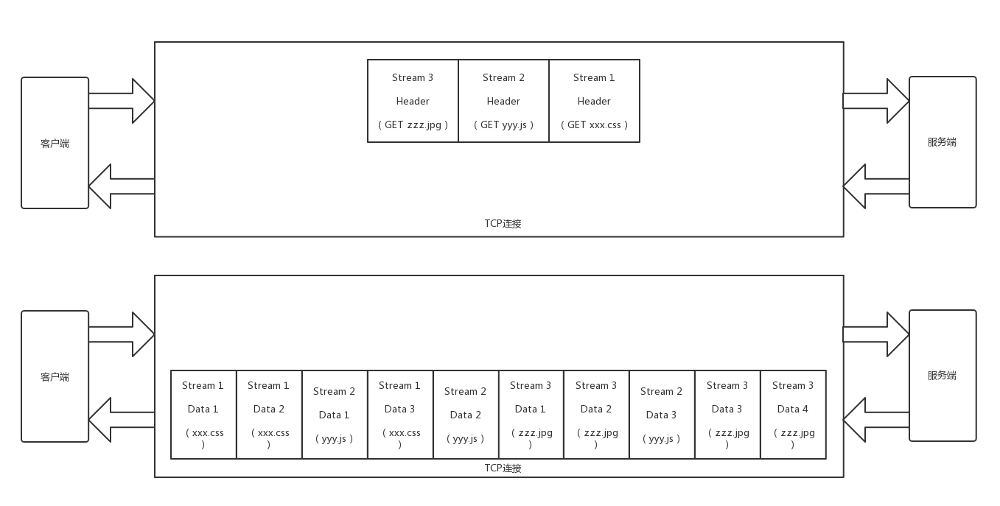
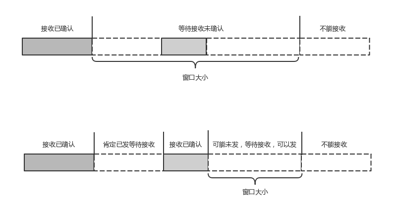

# 第14讲 | HTTP协议：看个新闻原来这么麻烦

## 笔记

### HTTP 请求的准备

* DNS解析IP
* `HTTP`基于`TCP`, 建立`TCP`链接
	* 现在默认是`1.1`协议, 默认是开启了`Heep-Alive`, 多次请求中复用

### HTTP 请求的构建

#### 请求行

* Request URL
* Request Method
* Version

### 请求首部

`key value`, 用冒号分隔.

* `Accapt-Charset`表示客户端可以接受的字符集.
* `Content-Type`正文的格式

### HTTP 请求的发送

基于`TCP`协议的, 使用面向连接的方式发送请求, 通过`stream`二进制流的方式传给对方.

同一个网段

* `IP`层->`ARP`获取目标地址`MAC`, 添加`MAC`头(源和目标), 发送出去.

不在同一个网段

* `IP`层->`ARP`获取网关的`MAC`, 然后发送.

### HTTP 返回的构建

浏览器作为客户端也在监听某个进程.

### HTTP 2.0

* 对`HTTP`的头进行一定的压缩, 将原来每次都要携带的大量`key value`在两端监理一个索引表, 对相同的头只发送索引表中的索引.
* 将一个`TCP`链接切分成多个流, 流是有优先级的.
* 帧
	* `Header`帧, 传输`Header`内容.
	* `Data`帧, 传输正文实体.

可以将多个请求分到不同的流中, 然后将请求内容拆成帧, 进行二进制传输. 这些帧可以打散乱序发送, 然后根据每个帧首部的流标识符重新组装, 并且可以根据优先级, 决定优先处理哪个流的数据.

* 左是`HTTP 1.1`, 串行请求
* 右是`HTTP 2.0`, 同时发送多个请求和回应
	* 将三个**请求**变成三个**流**, 将数据分成帧, 乱序发送到一个`TCP`连接中

总结:

* `2.0`解决了`1.1`的队首阻塞问题, 同时, 也不需要通过`HTTP 1.x`的`pipeline`机制用多条`TCP`链接来实现并行请求与相应.
* 减少了`TCP`连接数对服务器性能的影响, 将多个数据如`css, js, jpg`等通过一个数据链接进行传输.

### QUIC 协议

TCP 协议在处理包时是有严格顺序的.

当其中一个数据包遇到问题, TCP 连接需要等待这个包完成重传. 虽然 HTTP 2.0 通过多个 stream, 使得逻辑上一个 TCP 连接上的并行内容, 进行多路数据的传输, 然而这中间并没有关联的数据. 一前一后, 前面 `stream 2`的帧没有收到, 后面`stream 1`的帧也会因此阻塞.

`TCP`切换到`UDP`就是`QUIC`协议.

#### 机制一: 自定义连接机制

`TCP`中的:

* 源IP
* 源端口
* 目的IP
* 目的端口

一个发生变化(比如wifi, 手机信号不稳), 就需要断开重连. 在进行三次握手.

`UDP`用一个`64`位速记数作为`ID`标识, `UDP`是无连接的. 只要`ID`不变, 就不需要重新建立连接.

#### 机制二: 自定义重传机制

`TCP`为保证可靠性, 使用**序号**和**应答**机制, 解决顺序问题和丢包问题.

* `TCP`如果发送`100`2次(因为第一次没有返回), 这是偶返回一个`ACK 101`, 代表客户端收到了. 这个RTT(采样往返时间)`ACK`是根据那次的发送计算. **采样不准确**
* `QUIC`通过序列号递增+`offset`

#### 机制三: 无阻塞的多路复用

`QUIC`是基于`UDP`的, 一个连接上的多个`stream`之间没有依赖.

假如 stream2 丢了一个 UDP 包, 后面跟着 stream3 的一个 UDP 包, 虽然 stream2 的那个包需要重传,但是 stream3 的包无需等待, 就可以发给用户.

#### 机制四: 自定义流量控制

`TCP`流量控制是通过**滑动窗口协议**.

`QUIC`是通过`window_update`, 来告诉对端它可以接受的字节数, **适应多路复用机制**.

* 可以在一个连接上控制窗口.
* 在一个连接中的每个`stream`控制窗口.

在 TCP 协议中, 接收端的窗口的起始点是下一个要接收并且 ACK 的包, 即便后来的包都到了, 放在缓存里面, 窗口也不能右移, 因为 TCP 的 ACK 机制是基于序列号的累计应答, 一旦 ACK 了一个系列号, 就说明前面的都到了, 所以只要前面的没到, 后面的到了也不能 ACK, 就会导致后面的到了, 也有可能超时重传, 浪费带宽。

QUIC 的 ACK 是基于 offset 的, 每个 offset 的包来了, 进了缓存, 就可以应答, 应答后就不会重发, 中间的空挡会等待到来或者重发即可, 而窗口的起始位置为当前收到的最大 offset, 从这个 offset 到当前的 stream 所能容纳的最大缓存, 是真正的窗口大小。显然, 这样更加准确.

还有整个连接的窗口, 需要对于所有的`stream`的窗口做一个统计.

## 扩展

### `pipeline`

不带`pipeline`, 客户端收到前一个请求的响应后才发出新的请求.

带`pepeline`, 碰到一个引用就立即发出一个请求.