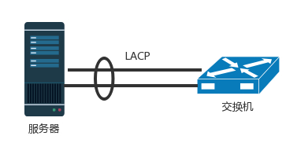
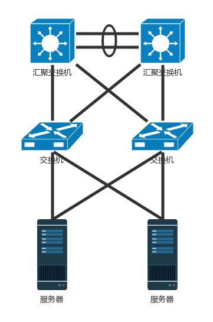
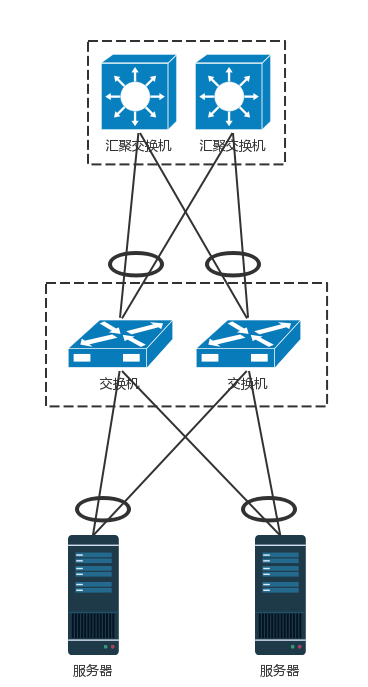
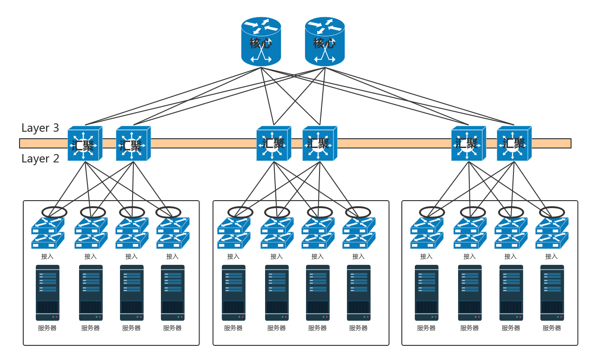
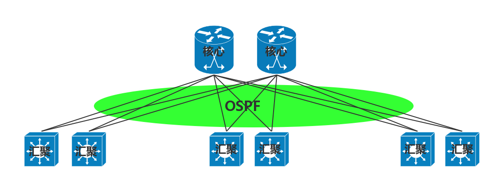
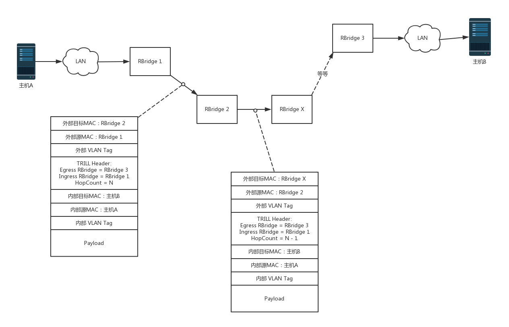
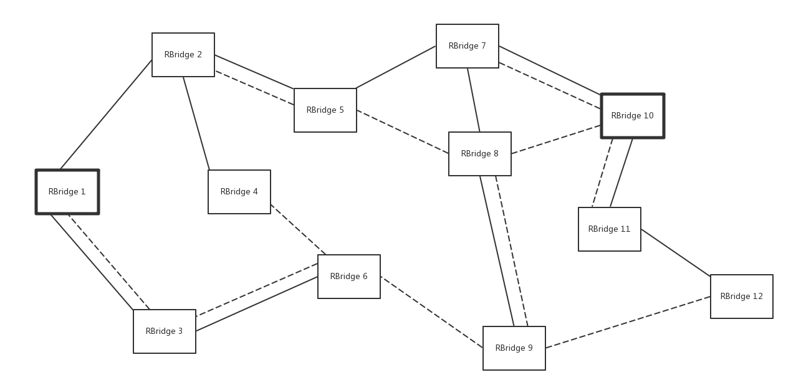

# 第21讲 | 数据中心：我是开发商，自己拿地盖别墅

## 笔记

### 名词

服务器放在**机架(Rack)**

数据中心的入口和出口也是路由器. 叫做**边界路由器**, 因为在数据中心的边界(就像在一个国家的边界).

为了高可用, 数据中心的边界路由器会连接多个运营商网络.

数据中心是路由协议中的**自治区域(AS)**.

通过**BGP协议**获取内外互通(iBGP, eBGP)的路由信息.

多线`BGP`, 数据中心的边界路由器会链接多个运营商网络.

### 交换机

机架上服务器非常多, 需要有交换机将这些服务器连接起来, 可以互相通信.

#### TOR 交换机

交换机往往是放在机架顶端的, 所以常被称为**TOR(Top Of Rack)交换机**. 这一层的交换机常常被称为**接入层(Access Layer)**.

#### 汇聚层交换机

多个机架, **汇聚层交换机(Aggregation Layer)**将多个机架连接在一起. 这些交换机:

* 性能要求高
* 带宽也更大

### 高可用

#### 网卡高可用-网卡绑定

如果服务器只有一个网卡, 一根网线接入到**TOR交换机**. 为了高可用, 需要至少两个网卡, 两根网线插到**TOR交换机**, 但是这两个网卡要工作得像一张网卡一样. 这个就是**网卡绑定(bond)**.

需要服务器和交换机都支持一种协议**LACP(Link Aggregation Control Protocol)**, 它们互相通信, 将多个网卡聚合称为一个网卡, 多根网线聚合成一根网线, 在网线之间可以进行负载均衡,

#### 交换机高可用

**传统方案STP**

部署两个介入交换机, 两个汇聚交换机. 服务器和两个接入交换机都链接, 接入交换机和两个汇聚都连接. 但是会形成回环. 启用`STP`协议, 去除环. 两个汇聚只能**一主一备**.

**堆叠方案**

**将多个交换机形成一个逻辑交换机**. 服务器通过多根线分配连到多个接入层交换机上, 而接入层交换机多根线分别连接到多个交换机上, 并且通过堆叠的私有协议, 形成**双活**的连接方式.

一般可能会有四个堆叠为一个逻辑交换机.

### 核心交换机

汇聚层将大量的计算节点相互连接在一起, 形成一个集群. 集群内, 服务器之间通过二层互通, 这个区域常被称为一个**`POD(Point Of Delivery)`** 或 **可用区(`Available Zone`)**. 

当一个可用区放不下的时候, 需要将多个可用区连在一起, 连接多个可用区的交换机是**核心交换机**.

核心交换机需求:

* 吞吐量更大
* 高可用要求更高

堆叠+部署多组核心交换机.

**核心和汇聚交换机之间为了高可用, 也是全互连模式的**.

#### 环路问题

* 二层不能有环路
	* 不同的可用区在不同的二层网络, 分配不同的网段. 汇聚和核心之间通过三层网络协议, 二层都不在一个广播域里面, 不会存在二层环路的问题.
* 三层可以用环路
	* 通过路由协议选择最佳路径就可以

核心层和汇聚层之间通过内部的路由协议`OSPF`, 找到最佳的路径进行访问, 而且还可以通过`ECMP`等价路由, 在多个路径之间进行负载均衡和高可用.

### 大二层

随着集群规模越来越大, 而且都要求在一个二层网络里面, 需要二层互联从汇聚层上升为核心层. 也即在**核心以下, 全部都是二层互连, 全部在一个广播域里面**, 这个就是大二层.

* 如果横向流量不大, 堆叠即可.
* 如果横向流量很大, 对接+部署多组核心交换机. 而且需要与汇聚层进行全互连.
	* 堆叠只解决一个核心交换机组内的无环问题, 组之间全互连, 还需要其他机制进行解决.
		* `STP` 无法扩大横向流量的能力, 因为还是只有一组起作用.
		* `TRILL`

#### TRILL(Transparent Interconnection of Lots of Link)

多链接透明互联协议.

基本思想: 二层环有问题, 三层环没问题, 把三层的路由能力模拟在二层实现.

运行`TRIL`协议的交换机称为`RBridge`, **具有路由转发特性的网桥设备**. 是根据**MAC**地址而不是IP地址.

`Rbridge`之间通过**链路状态协议**运作. 通过它可以学习整个大二层的拓扑, 知道访问哪个`MAC`应该从哪个网桥走. 还可以计算最短的路径, 也可以通过等价的路由进行负载均衡和高可用性.

`TRILL`协议在原来的`MAC`头外面加上自己的头, 以及外层的`MAC`头.

TRILL头

* Ingress RBridge: 类似`IP`头里面的源`IP`地址.
* Egress RBridge: 类似目标`IP`地址.

这两个地址是端到端的, 在中间路由的时候, 不会发生改变. 而外层的`MAC`, 可以有下一跳的`Bridge`, 就像路由的下一跳, 也是通过`MAC`地址来呈现的一样.

如图所示, 包里面分内网两层.

* 内层是传统的主机`A`和主机`B`的`MAC`地址以及内层的`VLAN`.
* 外层:
	* `TRILL`头, 描述这个包从`RBridge 1`进来的, 从`RBridge 3`出去.
	* 跳数(类似三层的IP地址一样)
	* 外部目标MAC
	* 外部源MAC
	* 外部VLAN Tag

如图, 当`RBridge 2`收到这个包之后
	
* 首先看`MAC`是否是自己的`MAC`, 
* 如果是, 要看自己是不是`Egress RBridge`, 是不是最后一跳. 
* 如果不是, 查看跳数是否大于`0`
* 然后通过类似路由查找的方式找到下一跳`RBridge X`
* 然后将包发出去

**与IP路由类似**

#### 分发树

* `STP`将一个有环的图, 通过去掉边形成一棵树.
* 分发树是一个有环的图形成多棵树, 不同的树有不同的`VLAN`, 有的广播包从`VLAN A`广播, 有的从`VLAB B`广播, 实现负载均衡和高可用.

### 核心交换机和边界路由器之间

* 核心交换机之外就是边界路由器
* 中间还有一些安全设备
	* DDoS防护
	* 入侵检测
	* ...

#### 存储网络

连接`SAN`和`NAS`

### 数据中心网络图

三层网络结构

* 接入层
* 汇聚层
* 核心层

#### 南北流量
 
外部流量请求到内部

#### 东西流量

不同的节点数据传递

叶脊网络(Spine/Leaf)

* 叶子交换机(leaf)
	* 直接连接物理服务器. `L2/L3`网络的分界点在叶子交换机上, 叶子交换机之上是三层网络.
* 脊交换机(spine switch)
	* 相当于**核心交换机**. **叶脊**之间通过`ECMP`动态选择多条路径. 脊交换机只是为叶子交换机提供一个弹性的`L3`路由网络. 南北流量可以不用直接从脊交换机发出, 而是通过与`leaf`交换机并行的交换机, 再接到边界路由器出去.

**叶脊网络是扁平架构, 更易于水平扩展**.

## 扩展

### AS自治域

为了便于网络管理, 人为地将互联网划分成若干自治系统. **每一个自治系统由一组在统一的机构管理下的路由器组成**, 整个系统对外呈现统一的路由机制, 并被看成独立的网络组成单元. 

自治系统由一个`16bit`的整数标识, 这个整数被称作自治系统号.

### BGP边界网络协议

是运行于`TCP`上的一种**自治系统**的**路由协议**.

主要功能是和其他的`BGP`系统交换网络可达信息. 包括**自治系统(AS)**的信息. 这些信息有效地构造了`AS`互联的拓朴图并由此清除了路由环路, 同时在`AS`级别上可实施策略决策.

边界路由器之间使用`eBGP`.

内网络需要访问其他的自治系统, 通过`iBGP`使得内部的路由器能够找到到达外网目的地的最好边界路由器.

### VLAN