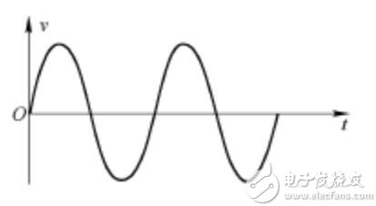

# 第23讲 | 移动网络：去巴塞罗那，手机也上不了脸书 

## 笔记

### 2G网络

`2G`时代上网使用的不是`IP`网络, 而是电话网络, 走**模拟信号**. 被称为**公共交换电话网(PSTN, Public Switched Telephone Network)**

#### 手机怎么上网

收集是通过**收发无线信号**来通信的. 专业名称是`Mobile Station`, 简称`MS`, 需要嵌入`SIM`.

* 手机是客户端
* **基站子系统(BSS, Base Station SubsystemBSS)**是服务端

山里的信号塔就是基站, 通过无线信号, 让手机可以通信.

**无论无线通信如何无线, 最终还是要连接到有线的网络里**

基站子系统分成两部分

* 对外提供无线通信：基站收发信台(BTS, Base Transceiver Station)
* 对内连接有线网络: 基站控制器(BSC, Base Station Controller)

**基站收发信台通过无线收到数据后, 转发给基站控制器**, 这部分属于无线的部分, 统称为**无线接入网(RAN, Raido Access Network)**.

基站控制器通过有线网络, 连接到提供手机业务的运营商的数据中心, 这部分称为**核心网(CN, Core Network)**, **核心网还没有真的进入互联网**, 这部分还是主要提供手机业务, 是手机业务的有线部分.

接待基站来的数据是移动业务交换中心**(MSC, Mobile Service Switching Center)**, 它是进入核心网的入口. **不会让你直接连接到互联网上**

认证是不是合法手机, **鉴权中心(AUC, Authentication Center)和设备识别寄存器(EIR, Equipment Identify Register)主要是负责安全性**

计费, 检查是不是外地号. **访问位置寄存器(VLR, Visit Location Register)是看你目前在的地方**, **归属位置寄存器(HLR, Home Location Register)是看你的号码归属地**

上网: 需要一个网关, 连接核心网和真正的互联网. **网关移动交换中心(GMSC, Gateway Mobile Switching Center)**, 然后是真正的互联网.

数据中心里面的这些模块统称为**网络子系统(NSS, Network and Switching Subsystem)**.

#### 2G网络特点

* 手机通过无线信号连接基站
* 基站
	* 超前接无线
	* 朝后接核心网
* 核心网
	* 超前接到基站请求
		* 判断你是否合法
		* 判断你是不是本地号码
		* 有没有钱
	* 通过网关连接电话网络

### 2.5G网络

## 扩展

### 模拟信号

模拟电压信号在时间上和幅值上均是连续的信号叫做模拟信号. 此类信号的特点是,在一定动态范围内幅值可取任意值. 许多物理量,例如声音、压力、温度等均可通过相应的传感器**转换为时间连续, 数值连续的电压或电流**.

随时间变化的模拟电压信号.

### 数字信号

与模拟信号相对应,时间和幅值均离散(**不连续**)的信号叫做数字信号. 数字信号的特点是幅值只可以取有限个值.

